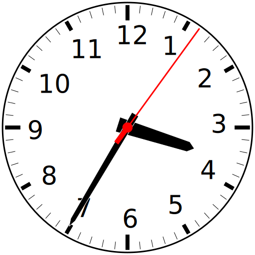

# svg-analog-clock
## Emacs analog clock rendered as an SVG

(Note: this was originally called `svg-clock-mode` but this was too
similar to an existing package on ELPA, so it was renamed to
`svg-analog-clock`)

### How to use:

1. Open `svg-analog-clock.el` file and do `M-x eval-buffer`

   **or**

   do `M-x load-file` and select `svg-analog-clock.el`.

2. Do `M-x svg-analog-clock`

3. When have have seen enough of the clock, type "q" to kill the clock
   buffer.

Once loaded, you can define the global variable
`svg-analog-clock-global-update-time-step` to set the clock redraw time step.
